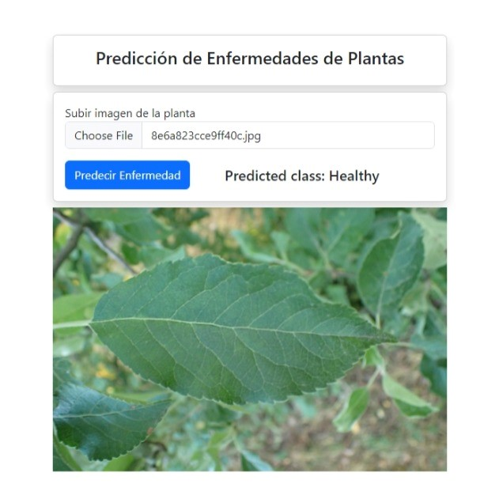

# PlantCNN
Detección de Enfermedades de Plantas con CNN

<<<<<<< HEAD
<table>
  <tr>
    <td></td>
    <td></td>
    <td></td>
  </tr>
  <tr>
    <td></td>
    <td></td>
    <td></td>
  </tr>
  <tr>
    <td></td>
    <td></td>
    <td></td>
  </tr>
</table>
=======

  
  
  

>>>>>>> c046b33865b9f82204a7601622c442492e849c22
